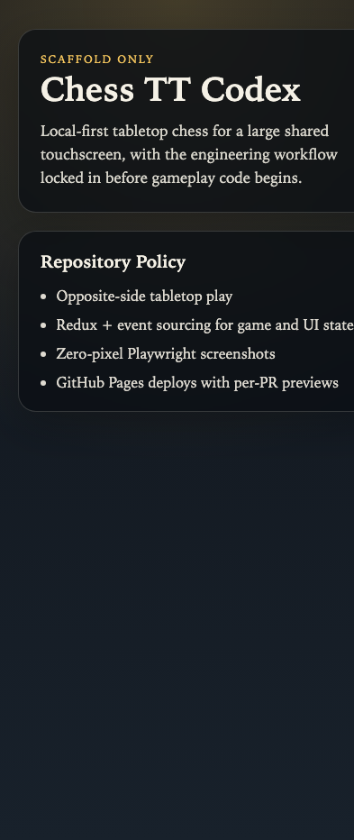

# Test: US-000: Scaffold Shell

## Initial Load

**Verifications:**
- [x] App shell loads at the root route
- [x] The page title is `Chess TT Codex`
- [x] The scaffold state is clearly visible
- [x] The repository policy panel is present
